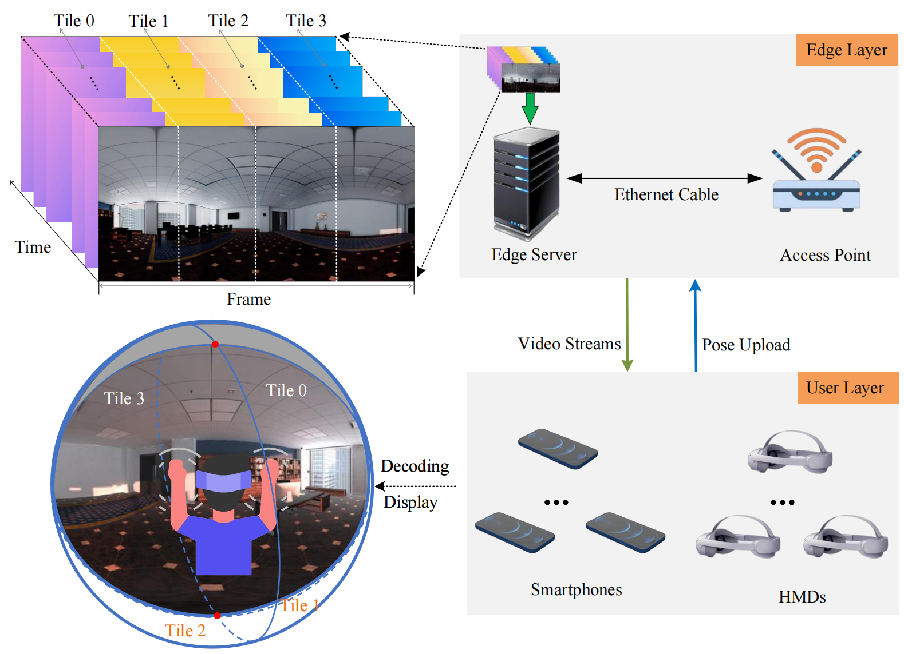
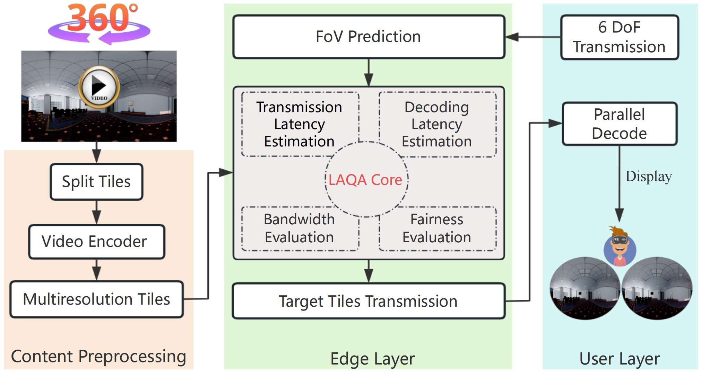

# LAQA

Virtual reality (VR) applications have revolutionized digital interaction by providing immersive experiences. 360° VR video streaming has experienced significant growth and popularity as a pivotal VR application. However, the combination of limited network bandwidth and the demand for high-quality videos frequently hinders the achievement of a satisfactory quality of experience (QoE). Although prior methods have enhanced QoE, the effects of decoding latency have been poorly studied. It is technically challenging to design a quality adaptation algorithm that can balance the pursuit of high-quality videos and the limitation of limited bandwidth resources. To address this challenge, we propose an edge-end architecture for 360° VR video streaming and aim to enhance overall QoE by solving a performance optimization problem. Specifically, our experiments on commercial mobile devices in real-world situations reveal that decoding latency significantly influences QoE. First, decoding latency plays a major role in contributing to end-toend latency, which exceeds the transmission latency. Second, decoding latency can differ considerably between devices with varying computational capabilities. Building on this insight, we propose a novel latencyaware quality adaptation (LAQA) algorithm. LAQA lies in developing a solution that can allocate video quality in real-time and enhance overall QoE. LAQA involves not only the quality of the received content, the transmission latency and the quality variance, but also the decoding latency and the fairness of the user quality. Subsequently, we formulate a combinatorial optimization problem to maximize overall QoE. Through extensive validation with experimental data from real-world situations, LAQA offers a promising approach to enhance QoE and ensure fairness performance in different devices. In particular, LAQA achieves 16.77% and 10.66% enhancement over the state-of-the-art combinatorial optimization and reinforcement learning algorithm, respectively, in terms of QoE at 4K resolution. Furthermore, LAQA ensures excellent scalability by simulating the number of users ranging from 15 to 60, making it a robust solution for diverse and growing user scales.


This project consists of two parts, namely simulation experiments and real-world experiment.

- simulation experiment

  We evaluate the performance of LAQA for large-scale users within a trace-based simulation system. We conduct a thorough investigation of our simulation experiments using realistic datasets that encompass user trajectories, network conditions, and bandwidth. Performance is assessed with varying numbers of VR users and at different resolutions (1080P, 2K, 4K). We explore critical metrics such as QoE, quality variance, and latency to highlight the algorithm’s scalability and efficiency in delivering high-quality video experiences.

- real-world experiment

  We evaluate the performance of LAQA with the actual performance of the prototype over commodity WiFi in the wild. Large-scale evaluations through the real user trajectory and different wireless network conditions demonstrate that LAQA achieves higher video quality, lower quality variation, and higher QoE than the state-ofthe-art algorithm. We also demonstrate through experimental analysis that the LAQA algorithm improves QoE more on devices with limited computational capability.

# System Architecture 


The architecture comprises an edge and user layer seamlessly connected via wireless communication. In the edge layer, the access point is connected to the edge server via an Ethernet cable. All videos cached in the edge server are dissected into frames based on a fixed time interval, and these frames are further partitioned into four rectangular tiles (e.g., Tile 0, Tile 1, Tile 2, and Tile 3). These tiles is encoded into multiple quality levels using FFmpeg . Based on the predicted user viewport and the edge server decision-making process, we select the appropriate number of tiles and the corresponding quality levels for transmission. In the user layer, which encompasses 𝑁 users, we utilize two categories of heterogeneous devices, including smartphones and HMDs. The user layer transmits the trajectory of each user’s six degrees of freedom (6 DoF) to the edge layer. 6 DoF are classified into translational and rotational degrees of freedom. The translational degrees of freedom include movement along the X, Y, and Z axes. The rotational degrees of freedom include rotation around these three axes: pitch, yaw, and roll. we have integrated motion prediction into the algorithm design and streamed the relevant part to present these tiles to the user. In reality, any motion prediction model can be incorporated into our architecture to predict the 6 DoF of each user. Therefore, our system considers multiple tiles and does not limit the transmission to just one tile. After receiving all target tiles, users decode them and then assemble them into a panoramic frame and present them on the device.

<div style="text-align: center;">
  
</div>


# Workflows


We select the VR content of virtual museum exploration from [Unity Asset Store ](https://assetstore.unity.com/packages/3d/environments/urban/qa-office-and-security-room-114109) . In the Unity environment, we divide the entire panoramic scene into a grid world with a granularity of 5 𝑐𝑚 × 5 𝑐𝑚, providing users with smooth translational motion. We use the equirectangular method  and obtain a rectangular representation of the panoramic scene by projecting this cylindrical surface onto a rectangular texture. We split each texture into four tiles. We use FFmpeg to encode every tile in the H.265 format. To meet real-time needs, we pre-render data and encode tiles into different quality levels with different CRF values. In this approach, the overhead associated with rendering and encoding VR content at various quality levels is eliminated by pre-processing the content offline. The server maintains a runtime memory buffer to cache relevant video tiles, optimizing performance by avoiding swapping latency. By predicting different FoV, the server selectively caches only the necessary tiles within that range and adjusts the cache dynamically based on user movement. This enables immediate transmission of requested VR content without incurring rendering, encoding, or buffering latency.


<div style="text-align: center;">
  
</div>

#  Specifications of  implementation

We use an edge server with an Intel i7-10700 CPU@2.90GHz, NVIDIA GeForce RTX 3060Ti Graphics Card, 32GB Memory, 8TB disk, and Windows 10 as edge layer. The edge server is a video server for LAQA decisionmaking and is implemented in IntelliJ IDEA with Java language. For the client side, we use six devices, comprising three Huawei smartphones and three Pico 4 HMDs. The CPUs of three Huawei smartphones are the Huawei Kirin 955, Huawei Kirin 810, and Huawei Kirin 970. The CPU of three Pico 4 HMDs is Qualcomm XR2. We have implemented a 360° VR video streaming player APP in Android Studio with JAVA language. We use Android Media Codec to accelerate video decoding, which is usually faster than pure software decoding. We use OpenGL ES for rendering, which allows us to project the equirectangular map to the panoramic view. Wireless transmission is facilitated using an ASUS RT-AX86U wireless router.


<table><thead>
  <tr>
    <th>No.</th>
    <th>Component</th>
    <th colspan="2">Specifications</th>
  </tr></thead>
<tbody>
  <tr>
    <td rowspan="2"><br>1</td>
    <td rowspan="2"><br>Access Point</td>
    <td>ASUS RT-AX86U</td>
    <td rowspan="2"><br>IEEE 802.11.ax</td>
  </tr>
  <tr>
    <td>AX5700 Router</td>
  </tr>
  <tr>
    <td rowspan="6"><br><br><br><br><br><br>2</td>
    <td rowspan="6"><br><br><br><br><br><br>Smartphone * 3</td>
    <td>Huawei Kirin 955</td>
    <td rowspan="6"><br><br><br><br><br><br>IEEE 802.11.ac</td>
  </tr>
  <tr>
    <td>Android 8.0</td>
  </tr>
  <tr>
    <td>Huawei Kirin 810</td>
  </tr>
  <tr>
    <td>Harmony OS 3.0</td>
  </tr>
  <tr>
    <td>Huawei Kirin 970</td>
  </tr>
  <tr>
    <td>Harmony OS 3.0</td>
  </tr>
  <tr>
    <td rowspan="3"><br><br>3</td>
    <td rowspan="3"><br><br>HMD * 3</td>
    <td>PICO 4 VR Headset</td>
    <td rowspan="3"><br><br>IEEE 802.11.ax</td>
  </tr>
  <tr>
    <td>Qualcomm XR2</td>
  </tr>
  <tr>
    <td>PICO OS 5.0</td>
  </tr>
  <tr>
    <td rowspan="4"><br><br><br><br>4</td>
    <td rowspan="4"><br><br><br><br>Edge Service</td>
    <td colspan="2">Intel i7-10700 CPU@2.90Hz</td>
  </tr>
  <tr>
    <td colspan="2">NVIDIA GeForce RTX 3060Ti</td>
  </tr>
  <tr>
    <td colspan="2">32GB Memory and 8TB disk</td>
  </tr>
  <tr>
    <td colspan="2">Windows 10</td>
  </tr>
  <tr>
    <td>a</td>
    <td>Android Media Codec</td>
    <td colspan="2">Hardware-accelerated decoding</td>
  </tr>
  <tr>
    <td>b</td>
    <td>OpenGL ES</td>
    <td colspan="2">Reproject the equirectangular map <br>to the panoramic view</td>
  </tr>
  <tr>
    <td>c</td>
    <td>Unity</td>
    <td colspan="2">Render all possible tiles of the scene</td>
  </tr>
  <tr>
    <td>d</td>
    <td>FFmpeg</td>
    <td colspan="2">Encode tiles with different CRF values</td>
  </tr>
</tbody></table>


# How the Code Works

## decoding_simulation

python


## decoding_server

Java

## decoding_client

Android 


# Cite this Work

This is the open source implementation of our TMC 2025 paper "Enhancing Quality of Experience for Collaborative Virtual Reality with Commodity Mobile Devices". If you use the code in an academic work, please cite:

```basic
@ARTICLE{10884912,
  author={Huang, Liang and Li, Yuqi and Liang, Hongyuan and Chi, Kaikai and Wu, Yuan},
  journal={IEEE Transactions on Mobile Computing}, 
  title={Enhanced VR Experience with Edge Computing: The Impact of Decoding Latency}, 
  year={2025},
  pages={1-18},
  doi={10.1109/TMC.2025.3541741}}

```


